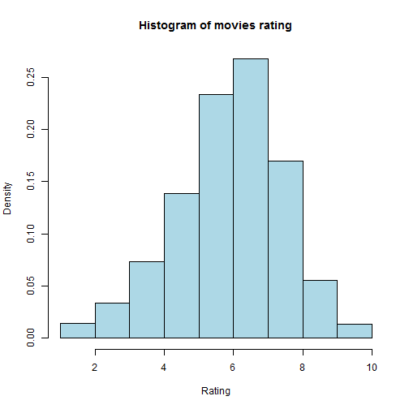
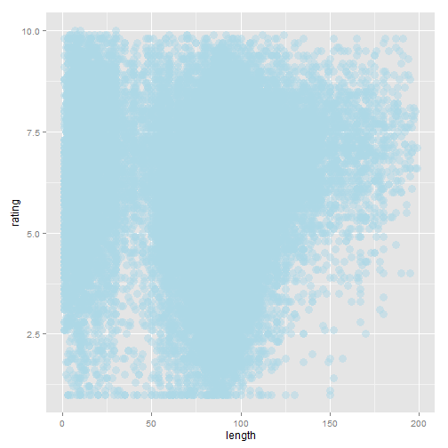

Movies analysis
========================================================
author:Aleksandar Kittov 
date:August 23, 2015 

Movie analysis
========================================================

***Movie analysis*** is a web based application is aiming to provide fast and convenient way of exploring ***movies*** data set from ***ggplot2*** package. This application uses the following technologies:

- [R Shiny](http://shiny.rstudio.com/)  by R Studio.
- [rCharts](http://rcharts.io/) by [Ramnath Vaidyanathan](https://github.com/ramnathv)
- ggplot2 dataset [movies](http://had.co.nz/data/movies/description.pdf) by [Hadley Wickham](http://had.co.nz/)

Functionality
========================================================
***Movie analysis*** has by far the following functionality:

1. Exploratory analysis:
      1. Summary - a standart call for **R** `summary()` **function**
      2. Histogram - draws a histogram for numeric variable. Allows for controling the range of the variable and the number of bins.
      3. Scatter plot - draws a scatter plot. Allows for choosing the x-axis and y-axis variables as well as the colloring variablre.

2. Prediction *

3. Help - Provides information and guidance about the app .

\* This section is under development

Histogram
========================================================

 

Scatter Plot
========================================================

 

