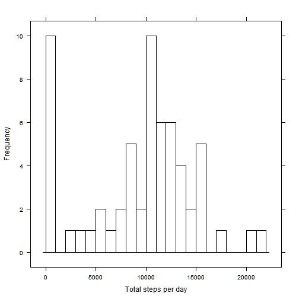
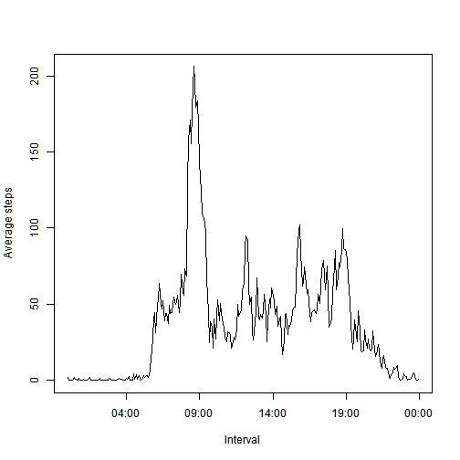

# Reproducible Research: Peer Assessment 1


## Loading and preprocessing the data


```r
fileURL <- "https://d396qusza40orc.cloudfront.net/repdata%2Fdata%2Factivity.zip"
destFile <- "activity.zip"
dataFile <- "activity.csv"
if (!file.exists(dataFile)) {
        if (!file.exists(destFile)) {
                # If the destionation is unreachable download.file throws error
                download.file (fileURL, destFile, method = "internal")
        }
        unzip(destFile )
}  

data <- read.csv(file = dataFile, header = TRUE)
data$date <- as.Date(data$date, format="%d/%m/%Y")

data$interval <- sprintf("%04d", data$interval)
data$interval <- as.POSIXct(data$interval, format = "%H%M")

data <- data[, c("date", "interval", "steps")]

head(data, n = 25)
```

```
##          date            interval steps
## 1  2012-10-01 2014-06-10 00:00:00     5
## 2  2012-10-01 2014-06-10 00:05:00     5
## 3  2012-10-01 2014-06-10 00:10:00    NA
## 4  2012-10-01 2014-06-10 00:15:00    NA
## 5  2012-10-01 2014-06-10 00:20:00    NA
## 6  2012-10-01 2014-06-10 00:25:00    NA
## 7  2012-10-01 2014-06-10 00:30:00    NA
## 8  2012-10-01 2014-06-10 00:35:00    NA
## 9  2012-10-01 2014-06-10 00:40:00    NA
## 10 2012-10-01 2014-06-10 00:45:00    NA
## 11 2012-10-01 2014-06-10 00:50:00    NA
## 12 2012-10-01 2014-06-10 00:55:00    NA
## 13 2012-10-01 2014-06-10 01:00:00    NA
## 14 2012-10-01 2014-06-10 01:05:00    NA
## 15 2012-10-01 2014-06-10 01:10:00    NA
## 16 2012-10-01 2014-06-10 01:15:00    NA
## 17 2012-10-01 2014-06-10 01:20:00    NA
## 18 2012-10-01 2014-06-10 01:25:00    NA
## 19 2012-10-01 2014-06-10 01:30:00    NA
## 20 2012-10-01 2014-06-10 01:35:00    NA
## 21 2012-10-01 2014-06-10 01:40:00    NA
## 22 2012-10-01 2014-06-10 01:45:00    NA
## 23 2012-10-01 2014-06-10 01:50:00    NA
## 24 2012-10-01 2014-06-10 01:55:00    NA
## 25 2012-10-01 2014-06-10 02:00:00    NA
```

## What is mean total number of steps taken per day?

```r
daylytotal <- tapply(data$steps, factor(data$date), sum, na.rm = TRUE)

mean <- mean(daylytotal)

median <- median(daylytotal)

totalStepsHist <- hist(daylytotal, breaks = 25, xlab = "Total steps per day")
```

 

The `mean` total number of steps per day is **9354.3934** and the `median` total number of steps per day is **10395**.

The histogram of the toatl number of steps per day is


## What is the average daily activity pattern?

```r
x <- aggregate(data, list(data$interval), mean, na.rm = TRUE)
x <- x[, c("Group.1","steps")]
names(x) <- c("interval","steps")
        
plot (x$interval, x$steps, type = "l",  xlab = "Interval", 
                                        ylab = "Average steps")
```

 

```r
maxsteps <- which(x$steps == max(x$steps))
x[maxsteps, c("interval", "steps")]
```

```
##                interval steps
## 104 2014-06-10 08:35:00 206.2
```

## Imputing missing values

```r
totalNA <- sum(is.na(data))
        
stepsList <- split(data$steps, factor(data$interval))
stepsList <- lapply(stepsList, 
        function(stepsList){
                stepsList[which(is.na(stepsList))] <- mean(stepsList, na.rm = TRUE)
                stepsList
        })
        
fillData <- data
fillData$steps <- unsplit(stepsList, factor(fillData$interval)) 
        
fillDaylyTotal <- tapply(fillData$steps, factor(fillData$date), sum, na.rm = TRUE)
daylyTotal <- tapply(data$steps, factor(data$date), sum, na.rm = TRUE)
        
par(mfrow = c(2,1), mar = c(4,4,2,1), oma = c(0,0,2,0))
        
hist(daylyTotal, breaks = 25, xlab = "Total steps per day")
hist(fillDaylyTotal, breaks = 25, xlab = "Total steps per day")
```

 

```r
fillMean <- mean(fillDaylyTotal)
fillMeadin <- median(fillDaylyTotal)
```

## Are there differences in activity patterns between weekdays and weekends?

```r
fDays<- factor((weekdays(data$date) %in% c('Saturday','Sunday')), 
                       labels = c("weekdays", "weekends"))
#daylytotals <- tapply(data$steps, fDays+factor(data$intervals), mean, na.rm = TRUE) 
lDaysSteps <- split(fillData, fDays)
lDaysSteps <- lapply(lDaysSteps, 
        function(x){
                aggregate(x, list(x$interval), mean, na.rm = TRUE)
        })
par(mfrow = c(2,1))
        
with(lDaysSteps[[1]], plot (Group.1, steps, type = "l", xlab = "Intervals", 
                                                        ylab = "Average steps"))
   
with(lDaysSteps[[2]], plot (Group.1, steps, type = "l", xlab = "Intervals", 
                                                        ylab = "Average steps"))
```

 
